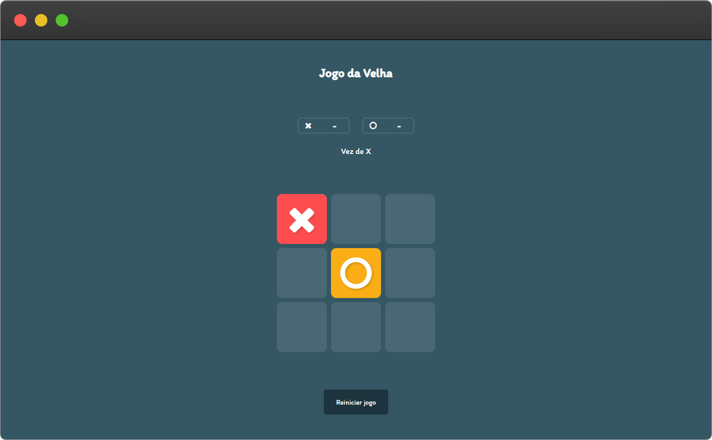

<h1 align="center">
⭕ Tic Tac Toe
</h1>

  
Example of tic tac toe made with HTML, CSS and Javascript, it also has an AI implemented with minimax algorithm.

  
   
   

# 🚀 Technologies

- 💀 HTML
- 💅 CSS
- 💡 JavaScript

# ✨ Features

- 👾 Artificial intelligence (machine)
- 📱 Responsiveness

# 🏃 Running

📝 Running the **project**

- Install extension [Live Server](vscode:extension/ritwickdey.LiveServer)
- Follow the steps described by the extension to go up the page

# ⭐ Credits

- [Algorithm Minimax](https://alialaa.com/blog/tic-tac-toe-js-minimax)
- [User Interface](https://codepen.io/IM-JUST-A-PERSON/pen/pobOYwL)

# 🔗 Links

- [Github](https://github.com/andersonsrocha)
- [LinkedIn](https://www.linkedin.com/in/anderson-silva-a40926192)

# 📝 License

This project is under the MIT license. See the [LICENSE](LICENSE) file for more details.
